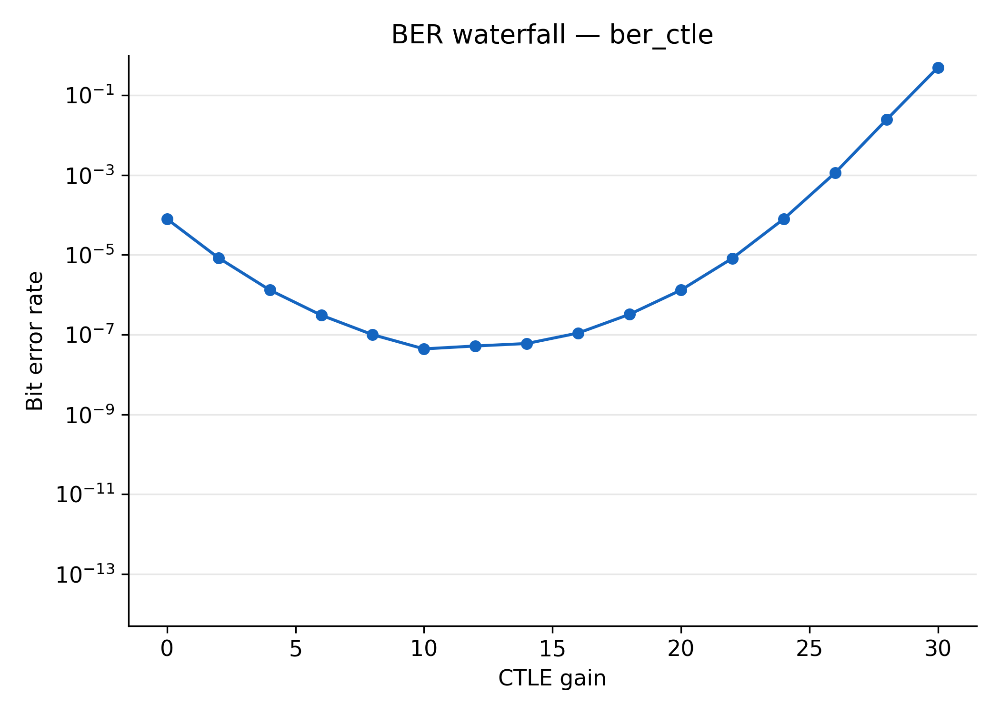
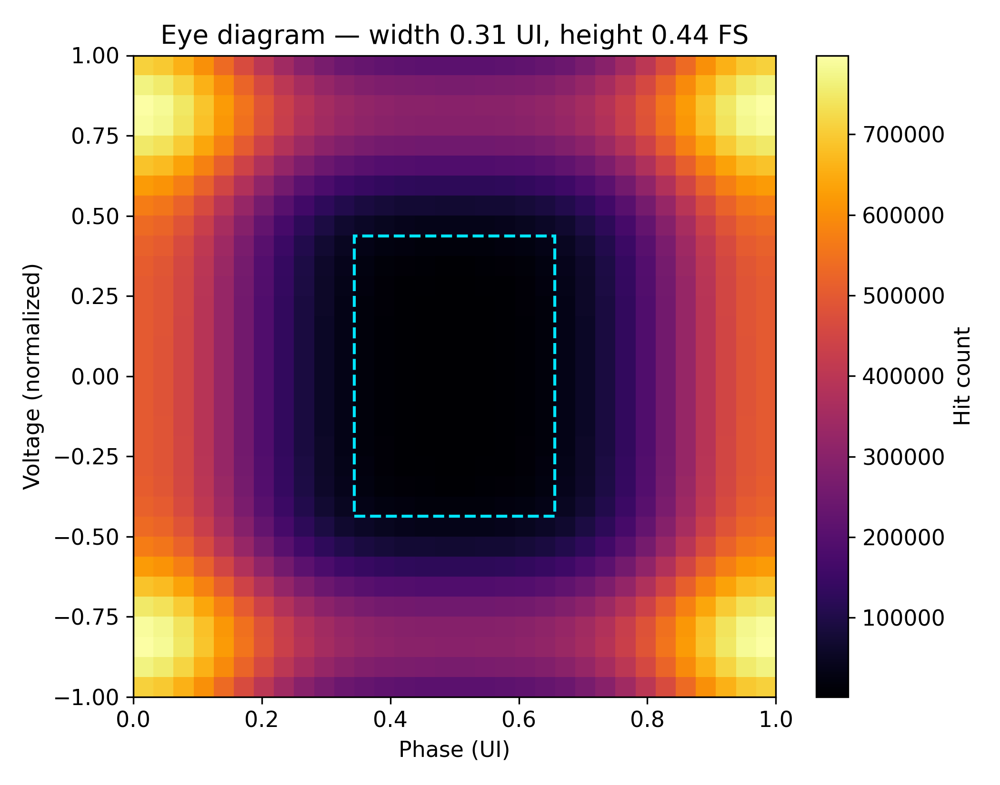

# Eyebert

**An open-source, fully scriptable SerDes bit error rate tester — with a
simulation mode that runs on any machine, no FPGA required.**

[](https://github.com/h-illman/eye-bert/actions)
[](LICENSE)

High-speed link validation today means vendor GUIs: Intel's Transceiver
Toolkit, Xilinx IBERT, or a $50k+ BERT instrument. They work, but they are
closed, hard to script, and impossible to learn from — you can't read the
register map, you can't see the lock algorithm, and you can't run any of it
without hardware on your desk.

Eyebert fills that gap: a complete BERT — PRBS generation, error counting
with lock/loss-of-lock, eye diagram capture — as readable SystemVerilog, a
documented register map, and a Python toolchain you can drive from a script
or a CI pipeline. A behavioral simulation backend means the entire software
stack (sweeps, BER waterfalls, eye heatmaps) runs on a laptop, so the project
is usable as a **learning tool and software testbed** even before the FPGA
board enters the picture.

| | |
|---|---|
|  |  |

*Output from simulation mode (`--sim`) — the CTLE bathtub curve and eye
heatmap with automatic eye-opening extraction. Hardware results will replace
these as bring-up progresses (see `docs/bringup_log.md`).*

---

## Try it in 60 seconds — no hardware

```bash
git clone https://github.com/h-illman/eye-bert && cd eye-bert
pip install -r requirements.txt
cd software/python
python sweep.py --mode ber_ctle --sim --bits 2e8   # CTLE gain sweep
python sweep.py --mode eye --sim                   # eye diagram capture
cd ../analysis
python plot_ber.py && python plot_eye.py           # renders to results/
```

The `--sim` flag swaps the `/dev/mem` backend for a behavioral model of the
register map and a lossy channel. Same code paths, same register accesses,
same plots — which is also how the software is tested in CI.

## Run the RTL test suite

```bash
sudo apt install iverilog
make -C sim all     # 6 self-checking testbenches
make -C sim lint    # elaborate the full hierarchy
```

| Testbench | Covers |
|---|---|
| `tb_prbs_gen` | 98k bits vs golden models, PRBS7/15/31 |
| `tb_ber_counter` | lock, clean counting, exact error/burst counts |
| `tb_eye_sampler` | raster FSM, histogram accumulation, readback |
| `tb_axi_csr` | AXI4-Lite protocol, byte strobes, pulse regs, back-to-back |
| `tb_stress` | PRBS period, mid-stream lock, mode switch, loss-of-lock → relock, dwell=1 |
| `tb_bert_top` | **full system**: AXI → CDC → PRBS → serial loopback → snapshot readback |

---

## What it is

The FPGA transmits a PRBS pattern through a multi-gigabit transceiver,
receives it back over an SMA loopback, and compares every bit against a
self-synchronizing local reference. The HPS (Linux on the ARM cores) drives
everything over an AXI-Lite register map:

- **PRBS generator** — Galois LFSR, PRBS-7/15/31 (ITU-T O.150)
- **BER counter** — self-syncing checker (locks in ~65 bits from any phase),
  64-bit counters with race-free snapshot readout, burst-length tracking,
  leaky-bucket loss-of-lock detection
- **Eye sampler** — 2D histogram in BRAM, up to 64×64 phase/voltage raster
- **AXI-Lite CSR** — full register map in [docs/register_map.md](docs/register_map.md)
- **Python stack** — `mmap`-based control, sweep orchestration, publication-quality plots

Target hardware: **Terasic DE25-Standard** (Intel Agilex 5 SoC,
A5ED013BB32AE4S) + **XTS-HSMC** SMA breakout. Quartus Pro + Buildroot Linux.

## Documentation

- [Technical report](docs/technical_report.md) — theory, design decisions, verification deep-dive
- [Architecture](docs/architecture.md) — block diagram, CDC strategy, lock algorithm
- [Register map](docs/register_map.md) — every field, every offset
- [Integration notes](docs/integration_notes.md) — Platform Designer wiring, first compile, first BER check
- [Bring-up log](docs/bringup_log.md) — honest status of what's measured vs simulated

## Project status

| Phase | Status |
|---|---|
| Phase 0 — environment setup | 🔄 In progress |
| Phase 1 — RTL + verification + sim-mode toolchain | ✅ Complete (6/6 TBs, 8/8 unit tests, CI green) |
| Phase 2 — transceiver bring-up | ⬜ Next — see [integration notes](docs/integration_notes.md) |
| Phase 3 — external SMA loopback | ⬜ |
| Phase 4 — hardware eye diagrams | ⬜ |
| Phase 5 — measured results & writeup | ⬜ |

## Repository layout

```
rtl/              SystemVerilog — PRBS, BER counter, eye sampler, CSR, top, IP stubs
rtl/tb/           6 self-checking testbenches + behavioral PHY model
platform/         Quartus QSF/SDC
software/python/  Control stack: csr_map, bert_ctrl, sweep, sim_backend
software/analysis/ plot_ber, plot_eye
software/tests/   pytest unit tests
software/hps/     Buildroot config, device tree (Phase 2)
docs/             Technical report, architecture, register map, bring-up log
.github/          CI: RTL testbenches + Python tests + e2e sim sweeps on every push
```

## License

MIT
